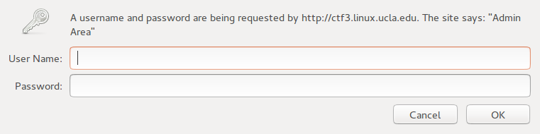

## Apache

__Description__

```
AwesomePossum's website is so ugly that it pisses you off. Since their
developers are so bad, you bet their security practices are terrible as well.
Maybe you can find something if you poke around?

http://ctf3.linux.ucla.edu/
```

__Hint__

```
Apache happily serves anything you ask, even "hidden" files
```

__Flag__

```
ejywyhzaimndxzhb
```

__Points__

```
30
```

## Solution

The website source files are in the `html` folder.

Classic static websites and PHP apps are organized in a hierarchy of
directories, like a filesystem. Although modern web frameworks (e.g. Flask,
Nodejs-based stuff, etc.) have moved away to use templating, occasionally some
legacy URL routes are left behind by careless developers.

Thus, it's often possible to find sensitive files or information by trying URLs
that normal users don't go to. This is called __URL fuzzing__, and tools exist
to automate fuzzing on target websites (bots love to fuzz, e.g.,
`/phpMyAdmin`!).

The website designed for this challenge is a series of static webpages, with a
password-protected `/admin` directory. However, it requires authentication to
enter:



Fuzzing a bit further will reveal a `/.gitignore` file, which has this content:

```
admin/
.myhtpasswd
```

That `.myhtpasswd` looks interesting:

```
awesumadmin:$apr1$ZHC/1uYD$b55WoXAkyJFsQFWiWj643/
```

This is an Apache .htpasswd file that it uses for HTTP basic authentication
credentials. The password is hashed, but in these situations, __John the
ripper__ is the right tool for the job. JtR is able to crack hashes by
intelligently trying words or phrases that people often use in passwords. This
specific type of hash (Apache MD5) is supported by the commonly used version of
JtR 1.7.9-jumbo-7 and upwards (Mac OSX users can try installing via homebrew).

Running JtR should yield something like this:

```
Loaded 1 password hash (md5crypt, crypt(3) $1$ [MD5 128/128 AVX 12x])
Will run 8 OpenMP threads
Press 'q' or Ctrl-C to abort, almost any other key for status
password8        (awesumadmin)
```

Logging into `/admin` with awesumadmin:password8 will show a directory index
containing the flag.

In retrospect, we probably should've made this problem worth more points. ;)
